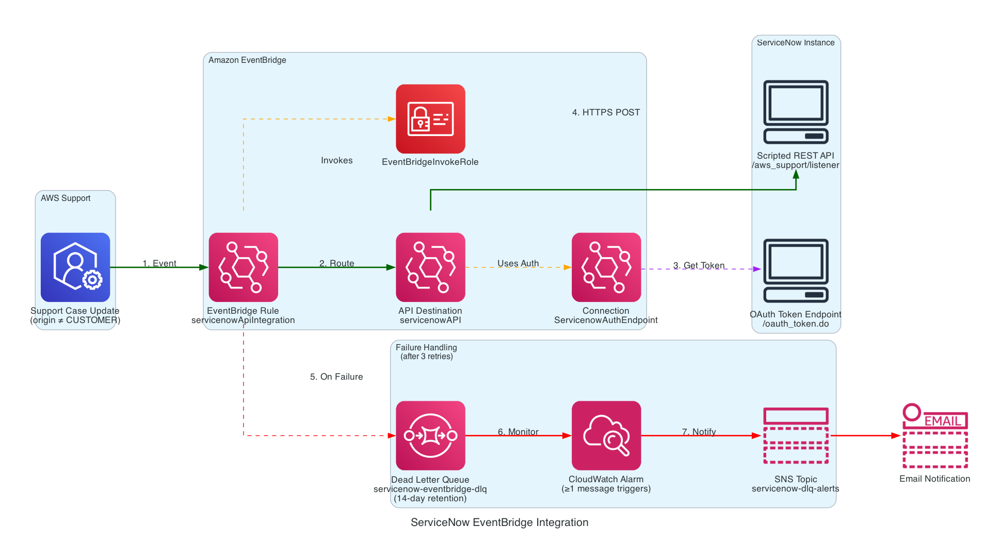

# AWS Support ↔ ServiceNow Integration

An event-driven, serverless alternative to the [AWS Service Management Connector](https://docs.aws.amazon.com/servicecatalog/latest/adminguide/integrations-servicenow.html) (end-of-support March 31, 2027). It delivers near real-time, bi-directional communication between **AWS Support** and **ServiceNow** using [Amazon EventBridge](https://aws.amazon.com/eventbridge/) — with no polling and no ServiceNow table modifications.



## How it works

| Direction | Mechanism |
|-----------|-----------|
| **AWS → ServiceNow** | EventBridge captures AWS Support case updates and delivers them via API Destinations with OAuth authentication |
| **ServiceNow → AWS** | ServiceNow authenticates to AWS with a dedicated IAM user and calls the AWS Support APIs directly (AWS SigV4) |

For the full narrative, architecture walkthrough, and design decisions, see the **[full article](./AWS_Blog_ServiceNow_EventBridge_Integration.md)**.

## Repository contents

| File | Purpose |
|------|---------|
| [`AWS_Blog_ServiceNow_EventBridge_Integration.md`](./AWS_Blog_ServiceNow_EventBridge_Integration.md) | Full write-up: architecture, deployment walkthrough, and design rationale |
| [`ServiceNow-Implementation-Guide.md`](./ServiceNow-Implementation-Guide.md) | ServiceNow-side implementation: the four SigV4 Script Include classes, webhook setup, and echo suppression |
| [`AWS-ServiceNow-Integration.yaml`](./AWS-ServiceNow-Integration.yaml) | **AWS → ServiceNow** event notification stack (EventBridge rule, API Destination, OAuth Connection, DLQ, CloudWatch alarm, SNS) |
| [`AWS-ServiceNow-Authentication-Decentralized.yaml`](./AWS-ServiceNow-Authentication-Decentralized.yaml) | **Auth Option 1** — dedicated IAM user in a single target account |
| [`AWS-ServiceNow-Authentication-Centralized-Hub.yaml`](./AWS-ServiceNow-Authentication-Centralized-Hub.yaml) | **Auth Option 2** — central identity account IAM user (hub) |
| [`AWS-ServiceNow-Authentication-Centralized-spoke.yaml`](./AWS-ServiceNow-Authentication-Centralized-spoke.yaml) | **Auth Option 2** — target account role (spoke) |
| [`Event_Driven_Architecture.png`](./Event_Driven_Architecture.png) | AWS → ServiceNow event-flow diagram |
| [`Cross_Account_IAM_Authentication_Architecture.png`](./Cross_Account_IAM_Authentication_Architecture.png) | Centralised (hub-and-spoke) authentication diagram |

## Prerequisites

- An AWS account with **Business, Enterprise On-Ramp, or Enterprise Support** (required to receive Support Case Update events).
- A ServiceNow instance with a **Scripted REST API** endpoint to receive events.
- ServiceNow **OAuth client credentials** (Client ID and Client Secret).
- Permissions to deploy IAM resources in the relevant account(s).

## Quick start

Deploy the **AWS → ServiceNow** event notification stack (must be `us-east-1` — AWS Support events are only available on the default event bus there):

```bash
aws cloudformation deploy \
  --template-file AWS-ServiceNow-Integration.yaml \
  --stack-name servicenow-eventbridge-integration \
  --capabilities CAPABILITY_IAM \
  --parameter-overrides \
    OAuthClientID=<client-id> \
    OAuthClientSecret=<client-secret> \
    ServiceNowEndpoint=<scripted-rest-api-url> \
    OAuthEndpoint=<oauth-token-endpoint> \
    AlertNotificationEndpoint=<alert-email> \
  --region us-east-1
```

Then choose an authentication model for the **ServiceNow → AWS** direction and deploy the matching template (Option 1 for a single account, Option 2 for multi-account hub-and-spoke). See the [full article](./AWS_Blog_ServiceNow_EventBridge_Integration.md#part-2-servicenow--aws-authentication) for the exact commands and the [implementation guide](./ServiceNow-Implementation-Guide.md) for the ServiceNow configuration.

> After deployment, the alert email recipient must confirm the SNS subscription to activate DLQ alerting.

## Clean up

```bash
# Event notification
aws cloudformation delete-stack --stack-name servicenow-eventbridge-integration --region us-east-1

# Authentication (Option 1 — decentralised)
aws cloudformation delete-stack --stack-name servicenow-auth

# Authentication (Option 2 — centralised): delete each spoke first, then the hub
aws cloudformation delete-stack --stack-name servicenow-auth-spoke
aws cloudformation delete-stack --stack-name servicenow-auth-hub
```

> The EventBridge Connection uses `DeletionPolicy: Retain` and must be removed manually via the console if no longer needed.

## Cost

This solution deploys billable AWS resources (EventBridge, SQS, CloudWatch, SNS, IAM, Secrets Manager). Costs are typically minimal for this workload, but you are responsible for any charges incurred. See the [AWS Pricing page](https://aws.amazon.com/pricing/) for details, and remember to run the clean-up steps when the resources are no longer needed.

## Disclaimer

This repository is provided as a reference implementation. No warranty is implied. Review and adapt the IAM policies, endpoints, and configurations to meet your own security and operational requirements before deploying to production.
